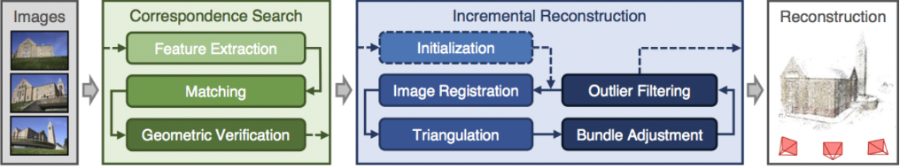
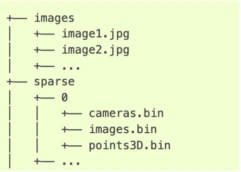

<h1 align="center">SceneCraft</h1>

The problem of generating 3D views from unstructured sets of 2D images is a long-running problem in computer graphics and vision. In the past decade, iterative methods of solving for the camera parameters from unstructured 2D view sets such as COLMAP (J. L. Schönberger and J.-M. Frahm, 2016)  have enabled novel methods of learning 3D representations, such as Neural Radiance Fields (NeRFs) (Mildenhall, Ben, et al. 2020). NeRFs generate camera rays, and fit them to the expected output values of the rays. This is essentially volume rendering with a neural network-learned volumetric function. One large flaw of these methods is that these learned functions can be exceedingly large and non-reusable. In this capstone project, we aim to efficiently generate small volumetric representations for different NeRF scenes without having to learn large independent networks. 

## Background 

### Photogrammetry

Photogrammetry is the method of extracting 3D information from 2D photos. This process involves taking overlapping photos of an object to capture its structure and space and reconstructing them into 2D or 3D digital models. This allows us to generate photorealistic 3D representations.

### COLMAP

COLMAP is a general-purpose Structure-from-Motion (SfM) and Multi-View Stereo (MVS) pipeline with a graphical and command-line interface. It offers a wide range of features for reconstruction of ordered and unordered image collections. It uses multiple images of an object or scene to create a detailed 3D model. Through COLMAP, we can extract the intrinsic parameters of all reconstructed cameras, and poses and key points of all reconstructed images in the dataset. This tool is crucial for creating accurate 3D models from multiple images, which is the main crux of our project.

COLMAP provides an automatic reconstruction tool that processes a folder of input images to produce a sparse reconstruction in a designated workspace folder. After running the tool, the workspace will contain the necessary files, which we then convert to a suitable format (transforms.json) for NeRF.

  

